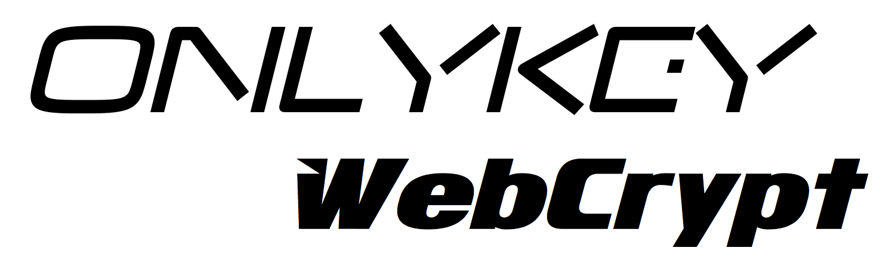

========

**Still in early development.**

## About

A prototype serverless OnlyKey Web App enabling encryption over any web platform, with the help of [keybase.io](https://keybase.io/) and [OnlyKey](https://crp.to/p/).

[Try it out here!](https://apps.crp.to)

## How it works

With Keybase user/key management is made easy and with OnlyKey private keys remain offline and protected. They are not accessible to the browser or the local computer. By using U2F the web application can send messages to OnlyKey to be securely decrypted and signed offline. This provides similar function to a token/smart card but no drivers or software required. All that is needed is a browser that supports U2F and an OnlyKey to send secure messages using Windows, Mac, Linux, Chromebook, and Android (with additional Android app).

* Alternatively, public keys can be input directly not requiring the use of Keybase. 

Please, feel free to commit fixes!

## Security Goals

**Empower the people**: Give people the ability to securely send and receive messages using any computer with no complicated software/drivers required.

**Serverless**: All processing done via javascript in users own browser locally (no server to hack).

**Private**: No logins required. No data retention. No tracking!!! No emails. No ads. No demographics. Retain no metadata, or other tracking information we don't know who / what / where you are.

**Strong Crypto** - Everything should be sent via HTTPS to/from the web application. Data between local browser and OnlyKey should be encrypted using AES/ECDH shared secret (Not fully implemented).

**Open source & audit-able** - What you see is what you get this repository is a Github page hosted directly on Github. 

## Protocol

The protocol outlined below utilizes existing communication channel via U2F. More
information is available on U2F protocol [here](https://fidoalliance.org/specs/fido-u2f-v1.0-nfc-bt-amendment-20150514/fido-u2f-raw-message-formats.html).

### Overview

U2F utilizes registration and authentication message types. To send data to the OnlyKey, messages are encoded in the Key Handle of the authentication message type. To receive data back, messages are encoded in the signature of the authentication response. This method provides a reliable form of communication that is supported anywhere U2F is supported including Chrome, Chromium, Opera, and Firefox (Quantum or w/plugin).

The outline below visualizes the use of onlykey-api.js and u2f-api.js to communicate via browser to OnlyKey over USB.

```
┌──────────────┐                                                   ┌─────────┐
│ APPLICATION  │                                                   │ OnlyKey │
└──────────────┘                                                   └─────────┘

INITIALIZE - SET TIME, SET APP PUBLIC KEY, GET ONLYKEY PUBLIC KEY, GET FIRMWARE VERSION

1. Authentication Request Message: 
init()

Encode a *packet in U2F Key Handle field that contains current epoch time and application public key.
┌──────────────────┬──────────────────┬──────────────────┐
│    challenge     │       appId      │    Key Handle    │  
│      random      │      crp.to      │     *packet      │  
│    (32 bytes)    │     (32 bytes)   │    (64 bytes)    │
└──────────────────┴──────────────────┴──────────────────┘
───────────────────────────────────────────────────────────────────────────▶

2. Authentication Response Message: 
custom_auth_response(response)

Decode a *packet with OnlyKey public key, OnlyKey firmware version, and unused space filled with hardware 
generated entropy (entropy not currently used but may be used for future secure key generation operations).
┌───────────────────┐
│     Signature     │
│     *packet       │
└───────────────────┘
◀───────────────────────────────────────────────────────────────────────────

DECRYPTION/SIGNING REQUEST - DECRYPT OR SIGN DATA USING RSA PRIVATE KEY 

1. Authentication Request Message: 
auth_decrypt(), auth_sign()

First, generate ECDH shared secret from OnlyKey's provided public key and application 
generated public key.

Encode a *packet in U2F Key Handle field that contains chunk of data to decrypt and specifies slot number 
of private key to use.
Repeat for each chunk of data.
┌──────────────────┬──────────────────┬───────────────────┐
│    challenge     │       appId      │     Key Handle    │  
│      random      │      crp.to      │      *packet      │  
│    (32 bytes)    │     (32 bytes)   │     (64 bytes)    │
└──────────────────┴──────────────────┴───────────────────┘
───────────────────────────────────────────────────────────────────────────▶

2.  Authentication Response Message: 
custom_auth_response(response)

Decode error code from response - Error type 1 (OTHER_ERROR) used as an ACK,
Acknowledge message received. Any other error code indicates failure.
┌─────────────────┐
│  Error Message  │      
│    (2 bytes)    │   
└─────────────────┘
◀───────────────────────────────────────────────────────────────────────────

Once full message is received both the App and the OnlyKey generate a hash of
the message that is used to generate a 3 digit code. The OnlyKey light flashes continuously
and the app prompts the user to enter the 3 digit code to authorize the signing / decrypting of
that message. This ensures that user presence is required to sign / decrypt and that the authorization 
applies to a specific plaintext, not a spoofed message. 

While waiting for the 3 digit code to be entered a ping is used to check status.

3. Authentication Request Message: 
auth_ping()

Encode a *packet in U2F Key Handle field that contains a ping request.
┌──────────────────┬──────────────────┬───────────────────┐
│    challenge     │       appId      │     Key Handle    │  
│      random      │      crp.to      │      *packet      │  
│    (32 bytes)    │     (32 bytes)   │     (64 bytes)    │
└──────────────────┴──────────────────┴───────────────────┘
───────────────────────────────────────────────────────────────────────────▶

4.  Authentication Response Message: 
process_ping_response(response)

Decode error code from response - 
Error type 1 (OTHER_ERROR) device status code: -7f, waiting for challenge code
Error type 1 (OTHER_ERROR) device status code: -80, incorrect challenge code entered
Error type 1 (OTHER_ERROR) device status code: -81, key type not set as signature/decrypt
Error type 1 (OTHER_ERROR) device status code: -82, no key set in this slot
Error type 1 (OTHER_ERROR) device status code: -83, invalid key, key check failed
Error type 1 (OTHER_ERROR) device status code: -84, invalid data, or data does not match key
Error type 1 (OTHER_ERROR) device status code: -90, correct challenge code entered
Error type 1 (OTHER_ERROR) device status code: -91, key type 1024 
Error type 1 (OTHER_ERROR) device status code: -92, key type 2048
Error type 1 (OTHER_ERROR) device status code: -93, key type 3072
Error type 1 (OTHER_ERROR) device status code: -94, key type 4096

┌─────────────────┐
│  Error Message  │      
│    (2 bytes)    │   
└─────────────────┘
◀───────────────────────────────────────────────────────────────────────────

Once the 3 digit code is entered correctly, the decryption / signing is completed and the result is stored on the 
OnlyKey until polling occurs (After 5 seconds unretrived messages are automatically wiped from OnlyKey).

3. Authentication Request Message: 
msg_polling({ type: poll_type, delay: poll_delay })

Encode a *packet in U2F Key Handle field that contains a request to retrieve stored data.
┌──────────────────┬──────────────────┬───────────────────┐
│    challenge     │       appId      │     Key Handle    │  
│      random      │      crp.to      │      *packet      │  
│    (32 bytes)    │     (32 bytes)   │     (64 bytes)    │
└──────────────────┴──────────────────┴───────────────────┘
───────────────────────────────────────────────────────────────────────────▶

4.  Authentication Response Message: 
custom_auth_response(response)

Decode a *packet containing the sessKey (for decryption) or the oksignature (for signing) and unused space filled with hardware generated entropy.
┌───────────────────┐
│     Signature     │
│     *packet       │
└───────────────────┘
◀───────────────────────────────────────────────────────────────────────────

```

## Licenses

Thanks to http://tilomitra.github.io/prettypages/

Copyright 2012 Yahoo! Inc. All rights reserved. Licensed under the BSD License. http://yuilibrary.com/license/

Thanks to Ron Garret for originally posting a serverless implementation of U2F here - https://github.com/rongarret/u2f-test

The MIT License (MIT)
Copyright (c) 2017 CryptoTrust LLC.

Permission is hereby granted, free of charge, to any person obtaining
a copy of this software and associated documentation files (the
"Software"), to deal in the Software without restriction, including
without limitation the rights to use, copy, modify, merge, publish,
distribute, sublicense, and/or sell copies of the Software, and to
permit persons to whom the Software is furnished to do so, subject to
the following conditions:

The above copyright notice and this permission notice shall be
included in all copies or substantial portions of the Software.

THE SOFTWARE IS PROVIDED "AS IS", WITHOUT WARRANTY OF ANY KIND,
EXPRESS OR IMPLIED, INCLUDING BUT NOT LIMITED TO THE WARRANTIES OF
MERCHANTABILITY, FITNESS FOR A PARTICULAR PURPOSE AND
NONINFRINGEMENT. IN NO EVENT SHALL THE AUTHORS OR COPYRIGHT HOLDERS BE
LIABLE FOR ANY CLAIM, DAMAGES OR OTHER LIABILITY, WHETHER IN AN ACTION
OF CONTRACT, TORT OR OTHERWISE, ARISING FROM, OUT OF OR IN CONNECTION
WITH THE SOFTWARE OR THE USE OR OTHER DEALINGS IN THE SOFTWARE.

## Cryptography Notice

This distribution includes cryptographic software. The country in which you currently reside may have restrictions on the import, possession, use, and/or re-export to another country, of encryption software.
BEFORE using any encryption software, please check your country's laws, regulations and policies concerning the import, possession, or use, and re-export of encryption software, to see if this is permitted.
See <http://www.wassenaar.org/> for more information.

The U.S. Government Department of Commerce, Bureau of Industry and Security (BIS), has classified this software as Export Commodity Control Number (ECCN) 5D002.C.1, which includes information security software using or performing cryptographic functions with asymmetric algorithms.
The form and manner of this distribution makes it eligible for export under the License Exception ENC Technology Software Unrestricted (TSU) exception (see the BIS Export Administration Regulations, Section 740.13) for both object code and source code.

The following cryptographic software is included in this distribution:

   "Fast Elliptic Curve Cryptography in plain javascript" - https://github.com/indutny/elliptic
   "RFC4880 Implementation in IcedCoffeeScript" - https://github.com/keybase/kbpgp

For more information on export restrictions see: http://www.apache.org/licenses/exports/
